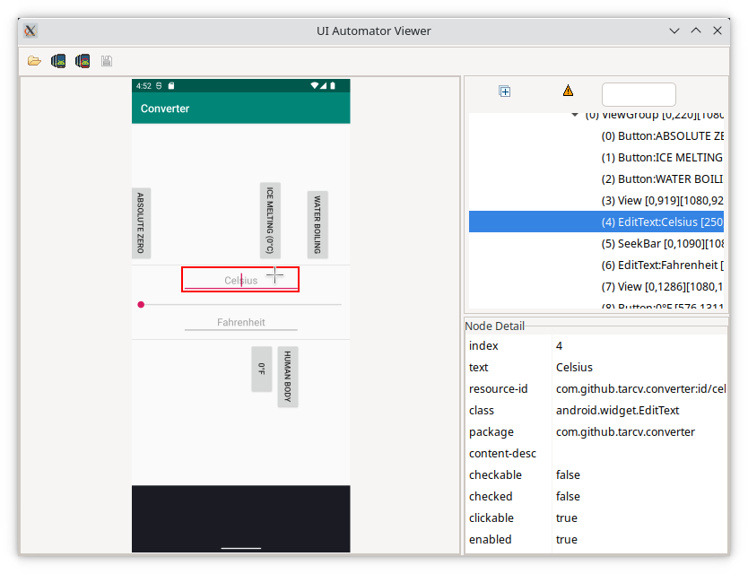

### Verifying this code against the SDK sources ###
1. **Verifying that this repository is actually based on the original viewer sources**: This repository is based on https://android.googlesource.com/platform/tools/swt/+/1ad1e59667a2b7ea4c0c90e3bfb76c39c5a96fb3/uiautomatorviewer/ .
The [initial commit - da94b667bbdc007d2bdf74d300932eb3dc75256e](https://github.com/TarCV/uiautomatorviewer-gradle/tree/da94b667bbdc007d2bdf74d300932eb3dc75256e) is exactly that directory.
Therefore, you can [download that source](https://android.googlesource.com/platform/tools/swt/+archive/1ad1e59667a2b7ea4c0c90e3bfb76c39c5a96fb3/uiautomatorviewer.tar.gz) and compare it against [the sources in that initial commit](https://github.com/TarCV/uiautomatorviewer-gradle/archive/da94b667bbdc007d2bdf74d300932eb3dc75256e.zip).<br/>There should be no differences except in timestamps.
2. **Reviewing changes**: Some changes were made to those original sources to fix building on the latest Java/OS/etc., update libraries, and for convenience. These changes can be reviewed by [comparing the current main with the initial commit](https://github.com/TarCV/uiautomatorviewer-gradle/compare/da94b667bbdc007d2bdf74d300932eb3dc75256e...main).

### Running ###
Install JDK 17+ if needed, older versions won't be able to build or run the app.
Build the app and its start scripts with `installDist` Gradle task. Make sure Android Debug Bridge is available.
Once that is done, you can just run the start script for your OS:
```bash
./gradlew installDist
./build/install/uiautomatorviewer-gradle/bin/uiautomatorviewer-gradle
```

**Note**: For Win, you might need the `.bat` scripts (`gradlew.bat` and `uiautomatorviewer-gradle.bat`) instead.

### Running in an IDE on a Mac ###
When using the `run` task from Gradle or calling the relevant start script for your OS (as described in [Running](#running)) everything should work as is.
Otherwise, make sure the option `-XstartOnFirstThread` is passed to JVM when launching the app from your IDE.

Also make sure Android Debug Bridge is available.
